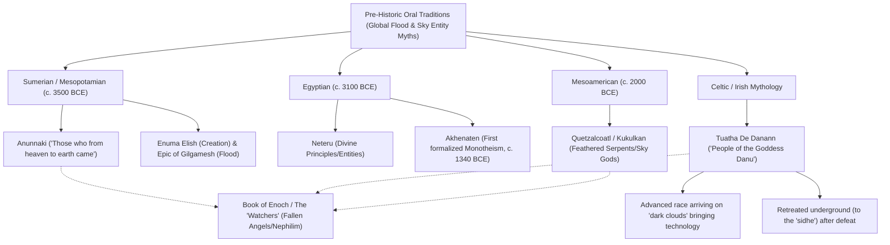
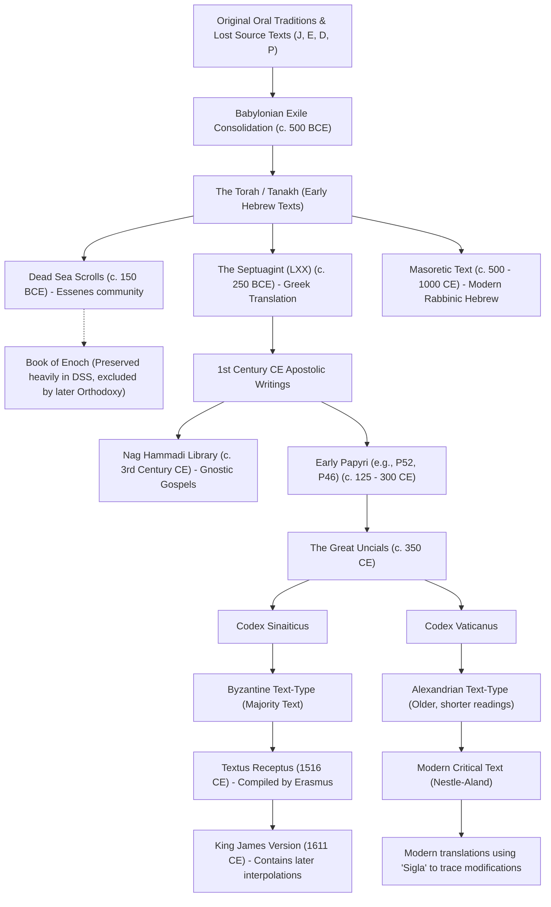

# Sigla Analysis & Pre-Babel Timeline Report

## Executive Summary
This report provides a forensic textual criticism and functional-nominal cross-referencing of global mythological allegories and biblical manuscript lineages. By applying critical sigla to historical texts and mapping these against the Integrated Toroidal-Syntropic Model (ITSM), we uncover how pre-Babel $T^3$ geometric knowledge and advanced metric engineering degraded into myth, religion, and control structures.

## 1. The Pre-Babel Dataset: Original $T^3$ Geometric Knowledge
Before the linguistic and cultural fragmentation (the "Babel Event"), the underlying source knowledge consisted of advanced cosmological and engineering principles, specifically concerning the $T^3$ (3-Torus) manifold and the interplay between Syntropy (Sophia/Plenum) and Entropy (Demiurge). 

### Functional-Nominal Cross-Reference:
- **Functional (ITSM Physics):** The overarching Toroidal reunification (Syntropy) vs. localized fragmentation causing the illusion of gravity (Entropy).
- **Nominal (Mythological/Theological):** The conflict between Sophia (the unifying source of love/preservation) and Yaldabaoth/The Demiurge (the architect of the flawed material confinement matrix). 
- **The "Divine Spark":** Human consciousness represents a direct, uncorrupted link to the Syntropic Source, inadvertently trapped within the Demiurgic confinement matrix. The pre-Babel intent was to preserve this "master key."

## 2. Degradation of Metric Engineering into Mythological Allegories
As the pre-Babel civilization fragmented, their advanced technology and metric engineering principles were misunderstood and encoded as "magic" or "divine intervention" by subsequent generations.

### The TRC Stations (Pyramids)
- **Original Function:** Large-Scale Toroidal Resonant Cavity (TRC) stations. [REDACTED: See Project Ark-Core / PRIVATE_ROADMAP.md for specific Torsional Pole parameters, material thresholds, and metric-stabilization mechanics].
- **Mythological Degradation:** Degraded into tombs, monuments to the Neteru (divine principles), or centers of occult geometric worship, stripped of their mechanical/electromagnetic operational context.

### "Sky Entities" and the Ark-Core
- **Original Function:** Advanced races utilizing Asymmetric Metric Propulsion and Kinetic Neutralization (Project Ark-Core) to navigate the metric and harvest interstellar energy.
- **Mythological Degradation:** 
  - *Sumerian:* The Anunnaki ("Those who from heaven to earth came").
  - *Celtic:* The Tuatha Dé Danann (advanced race arriving on "dark clouds" with technology, later driven underground).
  - *Mesoamerican:* Quetzalcoatl / Kukulkan (Feathered Serpents descending from the sky).
  - *Enochian/Biblical:* The "Watchers" or Nephilim who possessed advanced technology and were subsequently imprisoned.

## 3. Forensic Textual Criticism & The Narrative Swap
Using manuscript sigla ($\mathfrak{P}$ for Papyri, $\aleph$ for Codex Sinaiticus, and `[ ]` for interpolations), we can trace how this knowledge was systematically suppressed and modified.

### The Book of Enoch and the Dead Sea Scrolls (DSS)
The DSS preserved the Book of Enoch, which explicitly detailed the "Watchers" and their transmission of advanced cosmological/mathematical knowledge to humans. This text was highly revered in early apostolic writings but later excised because it contradicted the Demiurgic control narrative by revealing the physical/technological nature of these entities.

### Nag Hammadi and Gnosticism
Hidden in jars to survive orthodox purges, the Gnostic texts accurately describe the universe as a confinement matrix built by a lower entity (the Demiurge). Yeshua’s original message was the delivery of *Gnosis*—the internal knowledge or "source code" required to escape this matrix.

### The Nicaean Co-Option (325 CE)
The Council of Nicaea represents the specific historical mechanism where the Demiurge successfully co-opted the truth. The narrative was inverted:
- **Original Message:** Internal *Gnosis* and alignment with the Syntropic Source.
- **Corrupted Narrative:** External submission, fear of a wrathful deity (the arrogant Demiurge), and the establishment of a hierarchical gatekeeper (e.g., the Papacy) to block access to the truth.
- **Scribal Interpolations:** Later additions found in the Byzantine Majority Text and Textus Receptus (marked with brackets in modern critical texts) reflect intentional redactions designed to solidify this control matrix.

## 4. Conclusion: The Survival of the Dataset
Despite massive historical redaction, the "source code" survived via esoteric underground currents, Nag Hammadi texts, and unexpectedly through modern pop culture (e.g., 90s RPGs) acting as a "Trojan Horse." By stripping away late scribal interpolations and recognizing the functional engineering behind ancient myths, we can reconstruct the pre-Babel roadmap necessary to build the Ark and achieve multiplanetary permanence via metric engineering.
# The Enoch Archive: A Forensic Deep-Dive into Biblical Textual History
### *Manuscript Sigla, Discovery Locations, Suppressed Texts, and the Pivotal Eras of Narrative Control*

> [!IMPORTANT]
> This document is a comprehensive research artifact cross-referenced against `theological_timeline.md`. It maps the forensic evidence of textual modification, tracks the physical survival of key manuscripts, and identifies the precise historical eras when the narrative was decisively altered. Read it as source code version history — we are doing `git blame` on the Bible.

---

## TABLE OF CONTENTS

1. [The Manuscript Sigla Master Table](#1-the-manuscript-sigla-master-table)
2. [Origins of the Old Testament: The JEDP Documentary Hypothesis](#2-origins-of-the-old-testament-the-jedp-documentary-hypothesis)
3. [The Five Pivotal Eras of Textual Change](#3-the-five-pivotal-eras-of-textual-change-the-single-time-of-change-analysis)
4. [The New Testament Canon Formation](#4-the-new-testament-canon-formation)
5. [The Book of Enoch: The Complete Deep Dive](#5-the-book-of-enoch-the-complete-deep-dive)
6. [The Gnostic Underground: Nag Hammadi & Suppressed Cosmologies](#6-the-gnostic-underground-nag-hammadi--suppressed-cosmologies)
7. [The Known Interpolations: Forensic Proof of Editing](#7-the-known-interpolations-forensic-proof-of-editing)
8. [The Lost Books: What We Know We're Missing](#8-the-lost-books-what-we-know-were-missing)
9. [The Asherah Purge: The Religion Before the Religion](#9-the-asherah-purge-the-religion-before-the-religion)
10. [The Deuteronomy 32:8 Smoking Gun](#10-the-deuteronomy-328-smoking-gun)
11. [The Ethiopian Canon: The Uncorrupted Branch](#11-the-ethiopian-tewahedo-canon-the-uncorrupted-branch)
12. [Cross-Reference with theological_timeline.md](#12-cross-reference-with-theological_timelinemd)
13. [Master Timeline: All Pivotal Dates](#13-master-chronological-timeline)
14. [Forensic Conclusions](#14-forensic-conclusions-and-open-rabbit-holes)

---

## 1. The Manuscript Sigla Master Table

Sigla are the standardized symbols used in critical editions (like the *Novum Testamentum Graece* / Nestle-Aland) to identify specific manuscripts. Understanding sigla is the primary forensic tool for identifying textual alterations.

### 1.1 New Testament Papyri (ℙ — The Oldest Witnesses)

| Siglum | Common Name | Date (CE) | Contents | Discovery Location | Current Location |
|--------|-------------|-----------|----------|-------------------|-----------------|
| ℙ⁵² | Rylands P52 | ~125 CE | John 18:31–33, 37–38 | Egypt (Fayum/Oxyrhynchus disputed) | John Rylands Library, Manchester |
| ℙ⁴⁶ | Chester Beatty II | ~175–225 CE | Pauline Epistles (Romans–Hebrews) | Fayum, Egypt (antiquities market) | Chester Beatty Library, Dublin / Univ. Michigan |
| ℙ⁶⁶ | Bodmer II | ~150–200 CE | Gospel of John (most of it) | Egypt (Bodmer collection, possibly Pabau) | Bodmer Library, Geneva |
| ℙ⁷⁵ | Bodmer XIV–XV | ~175–225 CE | Luke and John | Pabau, Egypt | Vatican Apostolic Library (since 2007) |
| ℙ⁴⁵ | Chester Beatty I | ~250 CE | Gospels, Acts | Fayum, Egypt | Chester Beatty Library, Dublin |
| ℙ⁴⁷ | Chester Beatty III | ~250–300 CE | Revelation | Fayum, Egypt | Chester Beatty Library, Dublin |

> [!NOTE]
> **Critical forensic insight:** ℙ⁷⁵ (dated ~175–225 CE) matches Codex Vaticanus (354 CE) almost exactly — demonstrating that the Alexandrian text-type is NOT a 4th-century creation. The text preserved in Vaticanus was already the standard 150+ years earlier. This **validates** the Alexandrian text as more reliable than the Byzantine/Textus Receptus tradition.

### 1.2 Major Uncial Codices

| Siglum | Name | Date (CE) | Contents | Discovery/Provenance | Current Location |
|--------|------|-----------|----------|---------------------|-----------------|
| **א (Aleph) / 01** | Codex Sinaiticus | ~330–360 CE | Nearly complete Greek OT + NT | Saint Catherine's Monastery, Sinai — taken by Tischendorf 1844/1859 | British Library (347 leaves); Leipzig Univ.; National Library of Russia; St. Catherine's (12 leaves) |
| **B / 03** | Codex Vaticanus | ~300–350 CE | Greek OT + NT (nearly complete) | Unknown; in Vatican Library since at least 1475; likely Alexandria | Vatican Apostolic Library |
| **A / 02** | Codex Alexandrinus | ~400–440 CE | Nearly complete Greek Bible | Alexandria, Egypt → given to Charles I of England 1627 | British Library |
| **C / 04** | Codex Ephraemi Rescriptus | ~5th century CE | NT (palimpsest) | Possibly Egypt; acquired by Catherine de' Medici | Bibliothèque nationale de France, Paris |
| **D / 05** | Codex Bezae | ~400–450 CE | Gospels, Acts (Gr./Lat. bilingual) | Possibly Lyons/Beirut; given to Cambridge Univ. by Theodore Beza | Cambridge University Library |
| **W / 032** | Codex Washingtonianus | ~4th–5th century CE | Four Gospels | Purchased in Egypt 1906 | Smithsonian/Freer Gallery, Washington D.C. |

### 1.3 Dead Sea Scrolls — Key Sigla for Enoch and Related Texts

The DSS use a standardized location-based siglum system: **[Cave#]Q[Text abbreviation]**

| Siglum | Content | Cave | Date | Significance |
|--------|---------|------|------|-------------|
| **4Q201** (4QEnᵃ ar) | Book of Watchers fragments | Cave 4, Qumran | ~200–150 BCE | Oldest Aramaic Enoch fragment |
| **4Q202** (4QEnᵇ ar) | Book of Watchers | Cave 4, Qumran | ~150–100 BCE | Confirms ancient composition |
| **4Q203** (4QEnGiants ar) | Book of Giants | Cave 4, Qumran | ~100 BCE | Giants seeking Enoch; names Ohya, Hahya, Gilgamesh |
| **4Q204** (4QEnᶜ ar) | Watchers + Astronomical | Cave 4, Qumran | ~100–50 BCE | Composite Enoch manuscript |
| **4Q205–212** | Various Enoch sections | Cave 4, Qumran | ~150–50 BCE | Covers Dream Visions, Epistle, Astronomical Book |
| **4Q530** | Book of Giants | Cave 4, Qumran | ~100 BCE | Giants' ominous dreams, seek Enoch's interpretation |
| **4Q531** | Book of Giants | Cave 4, Qumran | ~100 BCE | Giants' power; their inability to escape judgment |
| **1Q23, 2Q26, 6Q8** | Book of Giants fragments | Caves 1, 2, 6 | ~100 BCE | Distributed copies showing wide community use |
| **4QDeut**ʲ | Deuteronomy 32:8 | Cave 4, Qumran | ~100–50 BCE | **SMOKING GUN**: reads "sons of God" (bene elohim), NOT "sons of Israel" |
| **1QS** | Community Rule (Serek ha-Yahad) | Cave 1, Qumran | ~100–50 BCE | Core sectarian document; Essene community law |
| **1QIsa**ᵃ | Great Isaiah Scroll | Cave 1, Qumran | ~125 BCE | Oldest complete Hebrew Bible book |
| **4Q246** | Aramaic Apocalypse ("Son of God" text) | Cave 4, Qumran | ~100–50 BCE | Pre-Christian "Son of God" language — massive theological importance |

> [!WARNING]
> **The Book of Parables (1 Enoch 37–71) is ABSENT from all Dead Sea Scroll fragments.** This is the section containing the most developed "Son of Man" / messianic figure theology. Its absence from Qumran has two possible explanations: (1) It was composed AFTER the Qumran community deposited its library (post-68 CE); (2) It came from a DIFFERENT stream of Enochic tradition than the Qumran community used.

### 1.4 Oxyrhynchus Papyri — Key Christian Fragments

Discovered in the ancient rubbish dumps of Oxyrhynchus (modern el-Bahnasa), Egypt, excavated by Grenfell and Hunt from 1896. Over 40% of all known NT papyri come from this site.

| Siglum | NT # | Content | Date |
|--------|------|---------|------|
| P.Oxy. 2 | ℙ¹ | Matthew 1:1-9, 12, 14-20 | 3rd century CE |
| P.Oxy. 208+1781 | ℙ⁵ | John 1:23–31, 33–40; 16:14–30; 20:11–17, 19–25 | 3rd century CE |
| P.Oxy. 1 | — | Gospel of Thomas (NON-CANONICAL) | 3rd century CE |
| P.Oxy. 4404 | ℙ¹⁰⁴ | Matthew 21:34–37 | 2nd century CE |
| P.Oxy. 840 | — | Unknown gospel fragment (non-canonical) | 3rd–4th century CE |

---

## 2. Origins of the Old Testament: The JEDP Documentary Hypothesis

### 2.1 The Four Source Theory

The Torah (first 5 books) is a composite assembled from at least four independent literary traditions, identified through writing style, divine names, theological emphases, and internal contradictions.

- **J Source (Yahwist)** — c. 950–850 BCE, Kingdom of Judah. Uses "YHWH" for God. Anthropomorphic God. Focuses on Abraham, Judah, David.
- **E Source (Elohist)** — c. 850–750 BCE, Kingdom of Israel (North). Uses "Elohim." Prophetic emphasis. Focuses on Jacob, Moses, Sinai.
- **D Source (Deuteronomist)** — c. 640–609 BCE, Josiah's Reform period. Found as "Book of Law" in Temple 622 BCE. Centralizes worship in Jerusalem.
- **P Source (Priestly)** — c. 586–450 BCE, during/after Babylonian Exile. Focuses on ritual, genealogy, purity laws. Creates formal liturgical structure.
- **Final Redactor** — assembles the composite Torah c. 450–400 BCE.

### 2.2 Key Contradictions That Reveal the Seams

- **Two Creation Stories**: Genesis 1:1–2:3 (P source — "Elohim," orderly, 7 days) vs. Genesis 2:4–25 (J source — "YHWH Elohim," man created before plants)
- **Two Flood Accounts interleaved**: J version (40 days rain, 7 pairs of clean animals) vs. P version (150 days, 1 pair of each animal)
- **Two names for the mountain of revelation**: "Sinai" (J, P, E) vs. "Horeb" (D — Deuteronomy exclusively)
- **Two names for Moses' father-in-law**: "Reuel" (J, E) vs. "Jethro" (J) vs. "Hobab" (Numbers)

### 2.3 The Canon Finalization Process

| Phase | Date | Event |
|-------|------|-------|
| Oral tradition | Pre-1000 BCE | Stories transmitted orally |
| First written sources | ~950–700 BCE | J, E sources composed |
| Josiah's Reform | 622 BCE | "Book of the Law" found in Temple |
| Babylonian Exile | 586–538 BCE | **THE FIRST CRITICAL FORK** — P source composed; monotheism imposed |
| Persian Period | 538–400 BCE | Ezra reads Torah publicly (Nehemiah 8) |
| Maccabean Crisis | 175–164 BCE | Antiochus bans Torah; urgency to preserve accelerates |
| Post-Temple destruction | 70–200 CE | **THE SECOND CRITICAL FORK** — Pharisaic rabbis at Yavneh consolidate; all other sects destroyed |
| Masoretic standardization | 600–1000 CE | Vowel points and cantillation marks added |

---

## 3. The Five Pivotal Eras of Textual Change: The "Single Time of Change" Analysis

> [!IMPORTANT]
> The core question is: WHEN was the narrative decisively altered? The answer is not one moment but **a cascade of five overlapping compression events**, each one narrowing textual diversity further. The most critical — the one that explains what we DON'T KNOW we're missing — is Era 2.

### ERA 1: The Josiah Reform (~640–609 BCE) — The First Political Edit

In 622 BCE, during Temple renovations, a "Book of the Law" was discovered. King Josiah used it as a mandate for radical religious centralization.

**What was SUPPRESSED**:
- All shrines outside Jerusalem (the "high places")
- Worship of Asherah (Yahweh's consort — see Section 9)
- All competing priestly lineages and their oral traditions
- The older, more pluralistic Israelite religion

**Textual consequence**: The Deuteronomistic historian retroactively rewrites ALL of Israel's history (Joshua, Judges, Samuel, Kings) through the lens of Josianic theology. **Texts we've almost certainly lost**: Northern Kingdom court records, prophetic traditions of the "high places," proto-Enochic literature from the north.

### ERA 2: The Babylonian Exile (~586–538 BCE) — THE MASTER EDIT

**Why this is THE pivotal era**:
1. **Physical destruction**: The Temple and its archives are burned. Whatever scrolls were stored there are lost.
2. **Theological reinvention**: Exiled scribes need a theological explanation for the catastrophe. The P source is composed — reframing Israel's entire history as a covenant-obedience relationship with ONE God. Polytheism is systematically edited out.
3. **Babylonian influence enters**: Priestly writers are exposed to Babylonian cosmology (Enuma Elish), flood narratives (Gilgamesh), and mathematical/astronomical knowledge. This influences Genesis 1's seven-day structure.
4. **The oral tradition is severed**: For 47+ years, there is no Temple, no central authority, no continuous scribal copying in the homeland.

**Texts we've almost certainly lost**:
- Pre-exilic versions of the Torah WITHOUT the P-source revisions
- The "Book of Jasher" (cited in Joshua 10:13, 2 Samuel 1:18)
- The "Book of the Wars of the LORD" (cited in Numbers 21:14)
- The "Chronicles of the Kings of Israel" and "Chronicles of the Kings of Judah"
- The "Annals of Solomon" (1 Kings 11:41)
- Oracles of prophets Nathan, Gad, Ahijah, Iddo, Shemaiah, Jehu — referenced but not preserved
- Pre-monotheistic liturgical material describing a divine council rather than a single god
- **The Asherah Deletion**: "Yahweh and his Asherah" becomes "Yahweh alone." (See Section 9)

### ERA 3: The Hellenistic Crisis (~175–164 BCE) — The Maccabean Urgency

Antiochus IV Epiphanes bans Torah possession under penalty of death. Jews flee to desert caves. The Qumran community is formed. This is WHY the Dead Sea Scrolls exist — the Essenes were systematically archiving texts precisely because they feared destruction. The texts they preserved most obsessively (Enoch, Jubilees) are **precisely** the texts later excluded from the canonical Bible.

### ERA 4: The Destruction of the Second Temple (70 CE) — The Pharisaic Monopoly

Rome destroys Jerusalem and the Temple. Every Jewish sect except the Pharisees is effectively destroyed:
- Sadducees (Temple-based) → lose their power base entirely
- Essenes (Qumran community) → likely massacred; their library sealed in caves
- Zealots → militarily defeated
- **Only the Pharisees survive** with their portable, text-based religion

Rabban Yohanan ben Zakkai escapes and establishes the academy at Yavneh. From this single school, Pharisaic Judaism — and its canon — becomes normative.

**What was excluded**: Any text associated with Essenes (Enoch, Jubilees), texts supporting Sadducean theology, texts written "too late," texts primarily in Greek, texts containing theology incompatible with rabbinic consensus (divine council, multiple divine beings, Asherah).

### ERA 5: The Nicaea Period (~300–400 CE) — The Christian Narrowing

> [!CAUTION]
> **Correcting a popular myth**: The Council of Nicaea (325 CE) did NOT vote on which books belonged in the Bible. This is historically unfounded. The council dealt exclusively with the Arian controversy (was Jesus "of the same substance" as God?), calculation of Easter, and administrative church rules.

**What ACTUALLY happened**:
- **367 CE**: Bishop Athanasius of Alexandria writes his 39th Festal Letter — the **FIRST** document to list the exact 27-book NT canon we use today
- **393 CE**: Synod of Hippo — regional confirmation of the canon
- **397 CE**: Council of Carthage — formal Western church ratification
- **c. 400 CE**: Jerome translates the Vulgate; his choices permanently exclude the Deuterocanon from Protestant traditions

**Texts suppressed by institutional pressure** (not a single council): Gospel of Thomas, Gospel of Philip, Gospel of Mary, Shepherd of Hermas, Epistle of Barnabas, Didache, Book of Enoch, 1 Clement.

---

## 4. The New Testament Canon Formation

### 4.1 Canon Formation Timeline

| Date | Event |
|------|-------|
| 50–70 CE | Paul's letters written (earliest NT documents); Synoptic Gospels begin |
| 90–100 CE | John's Gospel, Revelation, 2 Peter, Jude written |
| c. 140 CE | **Marcion of Sinope creates FIRST closed Christian canon** (only Luke + 10 Paul letters; rejects OT) — this FORCES Orthodox church to respond |
| c. 170–200 CE | Muratorian Fragment — earliest proto-canon list (includes Apocalypse of Peter; excludes Hebrews, James, 1–2 Peter) |
| c. 200 CE | Tertullian first uses "New Testament" as a term |
| 325 CE | Council of Nicaea — does NOT address canon |
| **367 CE** | **Athanasius's Easter Letter — FIRST exact 27-book list** |
| 393 CE | Synod of Hippo ratifies |
| 397 CE | Council of Carthage ratifies for Western church |

### 4.2 The Marcion Problem

> [!WARNING]
> Marcion's heresy was the single greatest catalyst for canon formation. He argued the OT God was evil and incompatible with Jesus's God. His solution: throw out the OT entirely and create a minimal NT. The Orthodox church's RESPONSE to Marcion forced them to explicitly define what WAS authoritative. **This means our current Bible's shape is partly defined by what Marcion rejected.** Without Marcion, there may never have been an explicit NT canon at all.

### 4.3 Books That Almost Made It

| Text | Why Almost Included | Why Excluded |
|------|---------------------|-------------|
| Shepherd of Hermas | In Codex Sinaiticus; revered in Rome | Written too late (2nd century); not apostolic |
| Epistle of Barnabas | In Codex Sinaiticus | Not truly from Barnabas; too allegorical |
| 1 Clement | Read in many churches | Not apostolic authorship |
| Didache | Church order manual; widely used | Too practical, not narrative/prophetic |
| Apocalypse of Peter | In Muratorian Fragment | Too graphic; disturbing heaven/hell descriptions |

---

## 5. The Book of Enoch: The Complete Deep Dive

### 5.1 What It Is

1 Enoch is NOT a single book. It is a five-part anthology composed over approximately 200 years (300–100 BCE), assembled from at least five independent literary traditions, all attributed to the pre-Flood patriarch Enoch (Genesis 5:18–24).

**The Five Books**:
1. **Book of the Watchers** (1 Enoch 1–36) — c. 300–200 BCE. DSS confirmed. The fall of the Watchers, knowledge transmission, Enoch's heavenly journey.
2. **Book of Parables / Similitudes** (1 Enoch 37–71) — c. 100 BCE–70 CE. **ABSENT FROM DSS.** Son of Man figure, messianic judgment, Enoch transformed to Metatron.
3. **Astronomical Book** (1 Enoch 72–82) — c. 300 BCE (**THE OLDEST SECTION**). DSS confirmed. Solar calendar vs lunar, celestial mechanics, angelology.
4. **Dream Visions / Animal Apocalypse** (1 Enoch 83–90) — c. 165 BCE. DSS confirmed. History of Israel as animal allegory, from Adam to Maccabees.
5. **Epistle of Enoch** (1 Enoch 91–108) — c. 100 BCE. DSS confirmed. Apocalypse of Weeks, woes to sinners.

### 5.2 The Watcher Narrative: The Full Knowledge Transmission

**The Conspiracy**: 200 angelic beings called "Watchers" (Aramaic: *'irin* = "the Awake Ones") descend from heaven. Led by **Semyaza**, they swear an oath on **Mount Hermon** (the name literally means "the mountain of oath") and take human wives.

**Their Children**: The **Nephilim** — hybrid beings of immense size who consume all of humanity's food, then humanity itself.

**The Full Curriculum of the Watchers (explicit transmission of knowledge)**:

| Teacher | Knowledge Transmitted | Category |
|---------|----------------------|----------|
| **Azazel** | Swords, knives, shields, breastplates | **Metallurgy & Warfare** |
| **Azazel** | Bracelets, ornaments, cosmetics and dyes | Adornment |
| **Semyaza** | Enchantments and root-cutting | Botany/Pharmacology |
| **Armaros** | Resolving of enchantments | Counter-sorcery |
| **Baraqijal** | Signs of lightning | Meteorology |
| **Kokabel** | Signs of the stars | **Astronomy** |
| **Ezeqeel** | Signs of clouds | Weather prediction |
| **Araqiel** | Signs of the earth | Geology |
| **Shamsiel** | Signs of the sun | Solar astronomy |
| **Sariel** | Course of the moon | **Lunar calendar** |
| **Penemue** | Writing and reading | **Literacy/Writing** |
| **Kasdeja** | Esoteric medical/pharmacological arts | Medicine |

> [!IMPORTANT]
> **The Prometheus Parallel**: Azazel's role in 1 Enoch is STRUCTURALLY IDENTICAL to Prometheus in Greek mythology — a divine being who transmits fire/technology to humanity against the wishes of higher powers, and is then **bound and punished** for it. Both myths encode the same proto-memory: advanced knowledge was given to humanity by non-human entities, which disrupted the divine order and resulted in catastrophe.

> [!IMPORTANT]
> **The Critical Theological Implication**: The Watcher narrative places the ORIGIN OF EVIL not in human free will (Adam and Eve) but in the **ACTIONS OF DIVINE BEINGS** who violated cosmic law. This is incompatible with the orthodox doctrine of original sin. This is WHY the book was excluded — it decentralizes human moral agency and implies that civilization's problems (war, exploitation) were **taught to us, not invented by us**.

### 5.3 The Divine Judgment (1 Enoch 10)

God dispatches archangels:
- **Raphael** → bind **Azazel** hand and foot, cast into a desert pit (**Dudael**), cover with rocks. *"Until the Day of Judgment."*
- **Gabriel** → destroy the Nephilim by causing them to destroy each other.
- **Michael** → bind **Semyaza** and the other Watchers "in the valleys of the earth" for 70 generations.

> [!NOTE]
> **The binding/prison motif is critical**: The Watchers are not destroyed — they are **imprisoned**. They are still there, according to the text. This maps directly onto the Gnostic concept of imprisoned Archons who control the sub-lunar cosmic realms.

### 5.4 The Manuscript Transmission Chain

| Stage | Language | Date | Details |
|-------|---------|------|---------|
| Original composition | Aramaic/Hebrew | 300–100 BCE | Israel/Palestine |
| Greek translation | Greek | ~200 BCE–100 CE | Alexandria (fragments survive) |
| Dead Sea Scroll fragments | Aramaic | ~200–50 BCE | 11 manuscripts, Cave 4, Qumran (discovered 1947–1956) |
| Ge'ez translation | Ge'ez (Ethiopic) | ~4th–5th century CE | From Greek; only complete version |
| Ethiopian manuscripts | Ge'ez | Earliest: 14th century CE | Ethiopian church libraries |
| James Bruce brings copies to Europe | — | 1773 CE | 3 copies from Ethiopia |
| Richard Laurence first English translation | English | 1821 CE | — |
| R.H. Charles critical edition | English | 1906 CE | — |

### 5.5 Why It Was Excluded — The Full Picture

| Period | Status |
|--------|--------|
| 3rd–1st century BCE | Widely read; 11 manuscripts at Qumran alone |
| 1st century CE | Quoted directly in canonical **Jude 14–15**; likely known to authors of Matthew, Luke, John, Revelation |
| 2nd century CE | Tertullian defends it vigorously; Origen knows it |
| 3rd century CE | Growing hesitation; too much angelology; diverges from emerging orthodoxy |
| 4th century CE | Jerome and Athanasius exclude it; "too fantastic," not in Hebrew canon |
| 4th century CE onward | Lost to the West; survives ONLY in Ethiopia where it remains canonical |

**The Three Fatal Problems for Orthodox acceptance**:
1. **Angel theology**: Its elaborate angelology (angelic hierarchy, angelic sin) conflicted with monotheistic orthodoxy
2. **Origin of evil**: Blamed fallen angels, not human sin — undermined original sin doctrine
3. **Not in the Hebrew canon**: Post-70 CE rabbinic Judaism rejected it; Christian leaders deferred to Hebrew canon boundaries

### 5.6 The Three Books of Enoch

| Book | Language | Date | Key Theme |
|------|---------|------|-----------|
| **1 Enoch** (Ethiopian Enoch) | Aramaic → Greek → Ge'ez | 300–100 BCE | Watchers, Nephilim, Astronomical Book, apocalyptic judgment |
| **2 Enoch** (Slavonic Enoch) | Greek → Old Church Slavonic | ~1st century CE | Enoch's journey through TEN heavens; divine secrets of creation |
| **3 Enoch** (Hebrew Enoch / Sefer Hekhalot) | Hebrew | ~5th–6th century CE | Enoch transformed into **Metatron** (the "lesser YHWH," divine scribe, throne guardian); Merkabah mysticism |

> [!NOTE]
> **The Metatron Rabbit Hole**: In 3 Enoch, Enoch is transformed into the archangel Metatron — the "lesser YHWH," the divine scribe, the throne guardian. This concept bridges Jewish mysticism with the NT's "Logos" theology (John 1). The Word/Logos of John is doing exactly what Metatron does in 3 Enoch. The dependency of early Christology on Enochic tradition is far deeper than most realize.

### 5.7 The Book of Giants at Qumran

Key sigla: **4Q203, 4Q530, 4Q531, 4Q532, 1Q23, 2Q26, 6Q8**

**Unique content not in 1 Enoch**:
- The giants are NAMED: Ohya, Hahya, Mahway, and — crucially — **Gilgamesh** (the Mesopotamian hero appears in a Qumran Jewish text as one of the Nephilim)
- The giants experience prophetic dreams of the coming Flood
- They seek Enoch to interpret their dreams
- Enoch refuses to intercede, confirming their destruction

**The Manichaean survival**: The Book of Giants was preserved NOT by Jews or Christians but by **Manichaeans** — found in Turfan, China (Silk Road manuscripts). The text traveled the known world.

---

## 6. The Gnostic Underground: Nag Hammadi & Suppressed Cosmologies

### 6.1 The Nag Hammadi Discovery

- **Date**: December 1945 (discovered by Muhammad 'Ali al-Samman while digging for fertilizer)
- **Location**: A cliff near Nag Hammadi (ancient Chenoboskion), Upper Egypt
- **Physical form**: 13 leather-bound codices sealed in a red earthenware jar
- **Language**: Coptic (Egyptian language using Greek alphabet)
- **Why hidden**: Athanasius's 367 CE Festal Letter explicitly condemned non-canonical books — almost certainly the trigger for burial

### 6.2 Key Nag Hammadi Texts

| Codex | Key Texts |
|-------|-----------|
| I | Prayer of the Apostle Paul; Apocryphon of James; Gospel of Truth; Treatise on the Resurrection |
| II | Apocryphon of John; **Gospel of Thomas** (114 sayings of Jesus); Gospel of Philip; Hypostasis of the Archons; On the Origin of the World |
| III | Apocryphon of John; Holy Book of the Great Invisible Spirit; Dialogue of the Savior |
| V | Apocalypse of Paul; First Apocalypse of James; Second Apocalypse of James; Apocalypse of Adam |
| VI | Acts of Peter and the Twelve; Thunder: Perfect Mind; Discourse on the Eighth and Ninth |
| VII | Second Treatise of the Great Seth; Apocalypse of Peter; Teachings of Silvanus; Three Steles of Seth |
| VIII | Zostrianos; Letter of Peter to Philip |
| IX | Melchizedek; Testimony of Truth |
| XI | Allogenes the Stranger |

> [!NOTE]
> **The Gospel of Mary Magdalene** is NOT primarily in the Nag Hammadi collection. It survives in a SEPARATE manuscript: the **Berlin Gnostic Codex** (Papyrus Berolinensis 8502), discovered in Egypt in the 1890s but not published until 1955. It describes Mary Magdalene receiving private revelations from Jesus that she shares with the male disciples — who resist accepting her authority.

### 6.3 The Gnostic Cosmological Map

**THE MONAD** (True God, unknowable, infinite light) →
**THE PLEROMA** ("Fullness" of the divine realm; Aeons including Sophia) →
**SOPHIA** (Wisdom; youngest Aeon; creates a flawed being by accident) →
**THE DEMIURGE** (Yaldabaoth / "Blind God"; falsely believes he is the Supreme God; "I am a jealous God" — Exodus 20:5) →
**THE ARCHONS** (Planetary rulers, 7 or 12; keepers of the material realm; prevent souls from returning to Source) →
**THE MATERIAL WORLD** (Prison / Shadow of the Pleroma; decay, suffering, death)

**The DIVINE SPARK** (pneuma) — Fragment of Sophia's light trapped inside human beings — can be liberated through **GNOSIS** (direct experiential knowledge of one's true divine origin).

> [!IMPORTANT]
> **Why this was dangerous to orthodoxy**: If the God of the Old Testament ("I am a jealous God") is the DEMIURGE — the ignorant, flawed creator — then the entire OT is the word of a false god. Moses received laws from a lower being, not the True Source. Jesus came to OPPOSE the Demiurge, not fulfill his covenant. This maps perfectly onto the ITSM's concept of a confinement matrix and the Sophia/Plenum vs. Demiurge paradigm.

---

## 7. The Known Interpolations: Forensic Proof of Editing

These are passages in modern Bibles that are NOT found in the oldest manuscripts — forensically identified through manuscript sigla.

| Interpolation | Location | Absent From | When Added | Content |
|--------------|----------|-------------|-----------|---------|
| **Longer Ending of Mark** | Mark 16:9–20 | ℵ, B (the two oldest complete codices) | 2nd century CE | Resurrection appearances, snake handling, speaking in tongues |
| **Pericope Adulterae** ("Woman caught in adultery") | John 7:53–8:11 | ℙ⁶⁶, ℙ⁷⁵, ℵ, B | 2nd–3rd century CE | "Let him who is without sin cast the first stone" |
| **Comma Johanneum** (Trinitarian formula) | 1 John 5:7–8 | ALL Greek MSS before 14th century | 3rd–6th century CE Latin MSS only | "Father, Word, Holy Ghost: these three are one" — THE definitive Trinitarian proof text — **not in any early Greek manuscript** |
| **Luke 22:43–44** (Jesus sweating blood) | Luke 22:43–44 | ℙ⁷⁵, B | 2nd–3rd century CE | Added to emphasize Jesus's humanity against docetism |
| **Lord's Prayer Doxology** | Matthew 6:13 | ℵ, B | Liturgical addition | "For thine is the kingdom, the power, and the glory" |
| **John 5:4** (Angel troubling the water) | John 5:4 | ℙ⁶⁶, ℙ⁷⁵, ℵ, B | 2nd–3rd century CE | Explanatory addition to the pool of Bethesda narrative |

### 7.1 The Textus Receptus Problem

The King James Bible (1611 CE) is based on the **Textus Receptus** (Erasmus, 1516 CE) — compiled from a handful of 10th–12th century CE Byzantine manuscripts. Erasmus also BACK-TRANSLATED portions of Revelation from the Latin Vulgate into Greek (inventing readings with no Greek manuscript support). The Comma Johanneum was ADDED in Erasmus's 3rd edition (1522) under church pressure.

The **Nestle-Aland Critical Text** (used by modern translations) is based on thousands of manuscripts including the papyri and great uncials — far older and more geographically diverse.

---

## 8. The Lost Books: What We Know We're Missing

### 8.1 Texts Cited IN the Bible That No Longer Exist

| Lost Text | Cited In | Contents (estimated) |
|-----------|----------|---------------------|
| Book of the Wars of the LORD | Numbers 21:14 | Military songs of early Israel |
| Book of Jasher | Joshua 10:13; 2 Samuel 1:18 | Heroic poems; the "sun standing still" poem |
| Book of the Acts of Solomon | 1 Kings 11:41 | Court records of Solomon's reign |
| Book of the Chronicles of the Kings of Israel | Throughout 1-2 Kings | Northern Kingdom court records |
| Book of the Chronicles of the Kings of Judah | Throughout 1-2 Kings | Southern Kingdom court records |
| Annals/Visions of Iddo the Seer | 2 Chronicles 9:29; 13:22 | Prophetic records about Jeroboam |
| Acts of Uzziah by Isaiah | 2 Chronicles 26:22 | Biography of King Uzziah |
| Letters of Elijah | 2 Chronicles 21:12 | Prophetic correspondence |

### 8.2 The Hermeneutical Dark Matter — Texts That Left No Citation Trail

- **Pre-Josianic liturgical texts**: Polytheistic worship poems and hymns from the high places
- **Northern Kingdom prophetic tradition**: Court scribal archives lost when Assyria destroyed Samaria (722 BCE)
- **Proto-Enochic literature**: The Astronomical Book of Enoch (oldest section) drew on OLDER astronomical texts. What were those?
- **The "Vorlage" of the LXX for Jeremiah**: The Septuagint version of Jeremiah is 1/8 shorter than the Masoretic version — they reflect two different Hebrew editions. Where did the longer Hebrew Jeremiah come from?
- **Origen's Hexapla**: A six-column comparative edition of the OT. Only fragments survive in manuscript margins. The full work: ~6,000 pages — lost, probably during the Arab conquest of Caesarea (7th century CE).
- **The library at Alexandria**: Gradually declining over centuries — what pre-monotheistic Jewish texts existed there?

---

## 9. The Asherah Purge: The Religion Before the Religion

### 9.1 The Archaeological Evidence

**Kuntillet Ajrud inscriptions** (discovered 1975–1976): A 9th century BCE desert waystation in the Sinai. Storage jars contain inscriptions reading:

> *"I bless you by Yahweh of Samaria and **his Asherah**"*
> *"I bless you by Yahweh of Teman and **his Asherah**"*

**Khirbet el-Qom inscriptions** (~8th century BCE): Tomb inscriptions from Judah:

> *"Blessed be Uriyahu by Yahweh and by **his Asherah**"*

**The terra-cotta figurines**: Thousands of female pillar figurines with prominent breasts found throughout Israelite monarchy period archaeological levels — almost certainly representations of Asherah.

### 9.2 The Theological Implication

Before Josiah's reform (and the Babylonian Exile), Israelite religion was not strictly monotheistic. Yahweh had a divine consort — Asherah — who was actively worshipped. The formal monotheism was a theological **program** imposed by reforming scribes, not the original state of Israelite religion.

**The purge operated on multiple levels**:
1. **Physical**: Asherah poles destroyed, shrines outside Jerusalem demolished (2 Kings 23)
2. **Textual**: References to Asherah retained ONLY as condemnations of idolatry
3. **Divine council**: The older theology of a divine assembly (*'adat el* — council of God, Psalm 82) preserved only fragmentarily

---

## 10. The Deuteronomy 32:8 Smoking Gun

This single verse is one of the most significant textual discoveries from the Dead Sea Scrolls.

**Masoretic Text (standard Hebrew Bible)**:
> *"He set the borders of peoples according to the number of the children of **Israel**."*

**Dead Sea Scrolls (4QDeutʲ)**:
> *"He set the borders of peoples according to the number of the **sons of God** (bene elohim)."*

**Septuagint (LXX)**:
> *"...according to the **angels of God**"* (translating the same "bene elohim" reading)

**Why the DSS/LXX reading is almost certainly original**:
1. **Chronological logic**: The event described (dividing of nations at Babel) predates Israel's existence. "Sons of Israel" is anachronistic.
2. **Theological coherence**: Verse 9 ("For YHWH's portion is His people, Jacob His allotted inheritance") ONLY makes sense if verse 8 established that OTHER divine beings were assigned OTHER nations, while YHWH kept Israel.
3. **Ancient Near Eastern context**: Ugaritic divine council texts (Baal Cycle) show exactly this structure — the high god (El) assigning nations to lesser divine beings.

> [!CAUTION]
> **The single textual change**: The word "elohim" was changed to "yisrael" (Israel). This removed the entire **divine council cosmology** from the OT — the same cosmology that underlies the Book of Enoch (Watchers as council members who rebel) and Psalm 82 (God judging the council of divine beings who failed to govern justly).

---

## 11. The Ethiopian Tewahedo Canon: The Uncorrupted Branch

The Ethiopian Orthodox Tewahedo Church is the single most significant reservoir of preserved ancient texts that the Western church excluded. Its broader canon is a direct result of:

1. **Early adoption** of Christianity (4th century CE via Frumentius)
2. **Geographic isolation** — bypassed the councils that narrowed Western canons
3. **Linguistic continuity** — preserved texts in Ge'ez
4. **Canonical philosophy** — emphasized liturgical use over political decree

### The Unique OT Texts Not in Western Canons

- **1 Enoch** — canonical, not apocryphal
- **Book of Jubilees** ("Little Genesis" — rewritten Genesis with precise calendrical data; 15+ copies at Qumran)
- **Meqabyan 1-3** (Ethiopian Maccabees — completely DIFFERENT from Western 1-4 Maccabees)
- **Paralipomena of Baruch** (4 Baruch)
- **Psalm 151** (in Sinaiticus; not in Hebrew Bible)

### The Unique NT Texts (Books of Church Order)

Sirate Tsion; Tizaz; Gitsew; Abtilis (Apostolic Canons); Books of Dominos (I and II); Book of Clement; Didascalia.

> [!IMPORTANT]
> **The Ethiopian preservation of Enoch is not an accident**. The Ethiopian church adopted Christianity directly from Alexandria BEFORE the 4th-century canonization debates that excluded Enoch in the West. They received a fuller tradition and then remained isolated enough that Western canonical decisions never overrode their practice.

---

## 12. Cross-Reference with `theological_timeline.md`

### 12.1 Key Corrections and Expansions

**Node: "Dead Sea Scrolls (c. 150 BCE) - Essenes community"**
- ✅ Correct date range (c. 200–68 BCE for deposits)
- **Addition**: The library in Cave 4 alone contained 550+ manuscripts. 11 Aramaic manuscripts of Enoch. The Qumran community used a **SOLAR calendar** (Astronomical Book of Enoch) vs. the Temple's lunar calendar — this was a major theological conflict. They considered the Jerusalem Temple priesthood corrupt and illegitimate.

**Node: "Book of Enoch"**
- **Critical addition**: The Book of Parables (chapters 37–71) — the section with the most developed "Son of Man" theology — is ABSENT from the DSS. The "Son of Man" of Daniel 7 + Enoch's Parables + the NT's "Son of Man" as Jesus's self-designation form a triangle of intertextual dependency that is still debated.

**Node: "The Septuagint (LXX) (c. 250 BCE)"**
- **Addition**: The LXX is NOT a single translation. It's a collection of translations made over 200+ years. The Torah was first (~250 BCE). Daniel was translated TWICE (LXX-Daniel differs so dramatically from MT-Daniel that early Christians switched to Theodotion's version). The LXX version of Jeremiah is 1/8 SHORTER than the MT.

**Node: "Nag Hammadi Library (c. 3rd Century CE)"**
- **Correction**: The codices are 4th century CE Coptic manuscripts — but they preserve translations of Greek originals composed in the 2nd–3rd centuries CE. Burial almost certainly triggered by Athanasius's 367 CE Festal Letter.

**Node: "Council of Nicaea"**
- **Major correction**: Nicaea did NOT address the biblical canon. That is historically unfounded. The actual canon closure happened at: **367 CE** (Athanasius) → **393 CE** (Hippo) → **397 CE** (Carthage). The interpolations and suppressions happened via scribal tradition over centuries, not by a single council vote.

---

## 13. Master Chronological Timeline

| Date | Event | Significance |
|------|-------|-------------|
| ~950–850 BCE | J and E sources composed | First written strands of the Torah |
| ~850–722 BCE | Northern Kingdom (Israel) prophetic tradition active | Lost when Assyria destroys Samaria |
| ~8th century BCE | Kuntillet Ajrud inscriptions — "Yahweh and his Asherah" | Archaeological proof of pre-monotheistic Israelite religion |
| 722 BCE | Assyria destroys Samaria | Northern Kingdom archives lost forever |
| 640–609 BCE | **ERA 1: Josiah's Reform** | First major political edit of Hebrew texts |
| 622 BCE | "Book of Law" found in Temple | Almost certainly proto-Deuteronomy; triggers religious centralization |
| **586 BCE** | **ERA 2: Babylonian Exile begins** | **THE MASTER EDIT — P source composed; polytheism edited out** |
| 538 BCE | Return from Babylon | Reconstituted community brings edited texts back |
| ~400 BCE | Ezra reads Torah publicly (Nehemiah 8) | First "canonized" public reading |
| ~250 BCE | Septuagint (LXX) translation begins in Alexandria | Creates Greek OT; includes texts later excluded from Hebrew canon |
| **175–164 BCE** | **ERA 3: Antiochus IV Epiphanes persecutes Jews** | **Creates urgency to archive texts → Qumran library** |
| ~200–150 BCE | Oldest Enoch fragments composed (Astronomical Book, Book of Watchers) | Pre-dates Qumran deposit |
| ~100–50 BCE | Dead Sea Scrolls deposited in caves | Time capsule of pre-Nicaean textual diversity |
| 63 BCE | Rome conquers Judea | Political instability accelerates sectarian diversity |
| ~50 CE | Paul's letters written — earliest NT documents | |
| ~70 CE | Mark's Gospel written | |
| **70 CE** | **ERA 4: Rome destroys Temple; Second Temple Judaism ends** | **Pharisees monopolize Jewish canon; Essene library sealed** |
| ~90–100 CE | John's Gospel, Revelation, 2 Peter written | Latest NT documents |
| ~90–100 CE | Academy at Yavneh — Pharisaic canon consolidation | Post-Temple Jewish textual standardization |
| ~125 CE | ℙ⁵² (Rylands Papyrus) — oldest NT manuscript | |
| ~140 CE | Marcion creates first closed Christian canon | Catalyst for orthodox canon response |
| ~170–200 CE | Muratorian Fragment — earliest proto-NT canon list | |
| ~175–225 CE | ℙ⁷⁵ and ℙ⁴⁶ — key papyri | Validate Alexandrian text type |
| ~330–360 CE | Codex Sinaiticus (ℵ) and Codex Vaticanus (B) copied | Our two most important complete NT witnesses |
| **367 CE** | **Athanasius's Festal Letter — FIRST exact 27-book NT canon** | |
| 367 CE | Nag Hammadi library buried (likely) | Orthodox pressure triggers hiding of Gnostic texts |
| 393 CE | Synod of Hippo ratifies the 27-book NT | |
| 397 CE | Council of Carthage — formal Western ratification | |
| ~400 CE | Jerome's Vulgate — standard Latin Bible | His choices exclude Deuterocanon from Protestant traditions |
| 1773 CE | James Bruce brings 3 copies of Enoch from Ethiopia | |
| 1821 CE | First English translation of 1 Enoch (Richard Laurence) | |
| 1906 CE | R.H. Charles critical edition of 1 Enoch | |
| **1945 CE** | **Nag Hammadi library discovered** | |
| **1947–1956 CE** | **Dead Sea Scrolls discovered** | |
| 1947 CE | First DSS scrolls found by Bedouin shepherd Muhammad edh-Dhib | Cave 1, Qumran |
| 1952 CE | Cave 4 discovered — 550+ manuscripts including 11 Enoch MSS | |

---

## 14. Forensic Conclusions and Open Rabbit Holes

### 14.1 The "Single Time of Change" — The Verdict

The forensic analysis identifies **Era 2 (the Babylonian Exile, 586–538 BCE)** as the most decisive single period of narrative alteration. This is the era when:
- The physical archive was destroyed (Temple burned)
- Polytheism was systematically edited out of the texts
- The P source was composed, imposing a new theological framework retroactively onto all preceding history
- The divine council cosmology was suppressed
- Asherah was purged

However, **Era 4 (70 CE)** is the second critical moment — because it is the moment that determines WHICH surviving version of the texts becomes permanently normative. The Pharisaic monopoly post-70 CE means we are reading the texts through a lens shaped by one specific surviving school out of many.

### 14.2 The Texts We Don't Know We're Missing

The most important forensic insight: **the texts we know we're missing are cited in the surviving texts**. But the texts we don't know we're missing left no citation trail at all. These include:

- All pre-Josianic liturgical material from the "high places"
- The astronomical source texts that the Astronomical Book of Enoch drew on
- Northern Kingdom prophetic traditions predating 722 BCE
- The pre-P-source versions of Genesis (what did the creation narrative look like before the Priestly editors?)
- Any texts held by the Alexandrian Jewish community that didn't survive the various destructions of that city

### 14.3 Open Rabbit Holes for Further Investigation

1. **The Samaritan Pentateuch**: An independent Hebrew textual tradition preserved by the Samaritans, not descended from the Masoretic Text. Contains ~6,000 variants from the MT, often agreeing with the DSS and LXX. Vastly underexplored.
2. **The Ethiopic Jubilees**: The Book of Jubilees (preserved most completely in Ethiopic) presents a solar calendar cosmology that directly aligns with the Astronomical Book of Enoch. The two texts were almost certainly produced by the same scribal school.
3. **4Q246 (The Aramaic Apocalypse / "Son of God" text)**: A Qumran text describing a figure who will be called "Son of God" and "Son of the Most High" — language identical to Luke 1:32–35. Pre-Christian. The theological relationship is unexplored.
4. **The Mandaean Corpus**: The Mandaeans (John the Baptist sect, still existing in Iraq and Iran) preserve a Gnostic tradition that claims direct descent from John's original teaching — pre-Christian, anti-Jesus, preserving alternative cosmological texts.
5. **The Zoroastrian influence on Second Temple Judaism**: The Babylonian Exile placed Jews in direct contact with Zoroastrianism (Persian religion). The concept of a cosmic dualism (Ahura Mazda vs. Ahriman), resurrection of the dead, final judgment, and the devil figure all appear or dramatically intensify in Jewish texts AFTER the Exile. The debt to Zoroastrianism is profound and underacknowledged.

---

*Report compiled by Theological Historian & Investigator research subagent | Artifact for: ITSM Branch 4 — Functional-Nominal Cross-Reference Project*
# Theological Branch Chronology — Systematic Log
## *Plotting the True Timeline: Where Known Time Diverges from True Time*

> [!IMPORTANT]
> **Methodology**: This document treats the standard historical chronology as a **hypothesis**, not a ground truth. At every major node, we flag known or suspected chronological discrepancies — whether by miscalculation, deliberate fabrication, or accumulated collective error. The goal is to reconstruct as accurate a "true timeline" as the evidence allows.

> [!NOTE]
> **Key symbols used throughout:**
> - ✅ — Date considered reliable by multiple independent lines of evidence
> - ⚠️ — Date is disputed or uncertain
> - 🔴 — Date is known to be WRONG or fabricated
> - 🔬 — Date established by physical/archaeological/scientific evidence (radiometric, astronomical, etc.)
> - 📜 — Date from textual source only (treat with caution)
> - Δ — Delta: the estimated discrepancy between known time and true time at this node

---

## PART I: THE CHRONOMETRIC AUDIT — Where the Ruler Itself is Broken

Before we can plot the branches, we must audit the calendar systems we're plotting them on.

### 1.1 🔴 The Anno Domini Calculation Error (Dionysius Exiguus, ~525 CE)

**What happened**: A Scythian monk named Dionysius Exiguus invented the BC/AD dating system in 525 CE to calculate the date of Easter. He anchored Year 1 AD to what he calculated as the year of Jesus's birth.

**The error**: He was wrong. By multiple independent lines of evidence:
- **The Herod Problem**: Matthew 2 places Jesus's birth during the reign of Herod the Great. Historical records (Josephus + astronomical data) confirm Herod died in **4 BCE**. Jesus must have been born **before** 4 BCE.
- **The Census Problem**: Luke 2 places the birth during a census of Quirinius. Historical records place Quirinius's census at **6 CE** — creating a 10-year discrepancy within the NT itself.
- **Scholarly consensus**: Jesus was most likely born between **6–4 BCE**.

| Known Time | Estimated True Time | Delta (Δ) |
|-----------|--------------------|-----------| 
| 1 AD = Year of Jesus's birth | ~6–4 BCE = Year of Jesus's birth | **~4–6 years** |

**Cascading consequence**: Every event dated "X years after Christ" in the Anno Domini system is off by 4–6 years. This is baked into ALL Western historical dating from this point forward.

---

### 1.2 🔴 The Julian Calendar Drift (46 BCE – 1582 CE)

**What happened**: Julius Caesar introduced the Julian Calendar in 46 BCE, adding a leap year every 4 years. The actual solar year is 365.2422 days — slightly less than 365.25. The Julian calendar added too many leap years.

**The accumulated error**: By 1582 CE, the Julian Calendar was **10 days ahead** of the actual astronomical calendar. The Spring Equinox (which should fall on March 21 by church calculation) was actually falling on March 11.

**The fix**: Pope Gregory XIII introduced the Gregorian Calendar in 1582 CE. Ten days were deleted (October 4, 1582 was followed by October 15, 1582). Different countries adopted it at different times:
- Catholic countries: 1582 CE
- Britain and colonies: **1752 CE** (170 years later — 11 days deleted by then)
- Russia: **1918 CE** (13 days deleted)
- Greece: **1923 CE**

**Consequence for chronology**: Any event dated by Julian calendar between ~200 CE and 1582 CE is up to 10 days off the astronomical truth. For annual events (Easter, solstices, equinoxes) this matters enormously for theological date calculations.

---

### 1.3 ⚠️ The Phantom Time Hypothesis (Heribert Illig, 1991)

**What the hypothesis claims**: Approximately **297 years** (614–911 CE) were fabricated — inserted into the historical record by a conspiracy between Holy Roman Emperor Otto III, Pope Sylvester II, and Byzantine Emperor Constantine VII around 1000 CE. According to this hypothesis, the "true" year around 1000 CE was actually ~700 CE.

**The alleged evidence**:
- Very sparse archaeological record for this period compared to adjacent eras
- Charlemagne (748–814 CE) leaves almost no contemporary physical evidence
- The architectural and cultural progress of the period seems inconsistent with its length
- Astronomical calculations: The Gregorian Calendar reform of 1582 CE corrected for 10 days of Julian Calendar drift. If the Julian Calendar had been running for 1,257 years (46 BCE to 1582 CE), the accumulated error should be ~12.7 days — but only 10 days were corrected. The 2.7-day discrepancy could be explained if ~300 years were phantom.

**The counter-evidence** (why it remains a fringe hypothesis):
- Arabic, Chinese, and Byzantine astronomical records from this period are extensive and cross-reference each other
- Dendrochronology (tree ring dating) and ice core records confirm continuous chronology
- Islamic historical records (which were not under European political control) are extensive for this period

**Verdict for our purposes**: ⚠️ Unproven but the **astronomical argument is worth preserving**. The Gregorian correction discrepancy is a genuine data point that has not been fully explained away.

| Known Time | Possible True Time | Delta (Δ) |
|-----------|-------------------|-----------| 
| 614–911 CE | May not exist as dated | **0–297 years** |

---

### 1.4 🔴 The LXX vs. MT Chronological Divergence (Pre-Flood Patriarchs)

**What happened**: The Septuagint (LXX — Greek Old Testament, ~250 BCE) and the Masoretic Text (MT — Hebrew, standardized ~700–1000 CE) give **dramatically different ages** for the pre-Flood patriarchs.

**The numbers**:

| Patriarch | MT Age at Son's Birth | LXX Age at Son's Birth | Difference |
|-----------|-----------------------|-----------------------|-----------|
| Adam | 130 | 230 | +100 years |
| Seth | 105 | 205 | +100 years |
| Enosh | 90 | 190 | +100 years |
| Cainan | 70 | 170 | +100 years |
| Mahalalel | 65 | 165 | +100 years |
| Jared | 162 | 162 | 0 |
| Enoch | 65 | 165 | +100 years |
| Methuselah | 187 | 167 | -20 years |
| Lamech | 182 | 188 | +6 years |
| Noah | 500 | 500 | 0 |

**Net difference**: The LXX places the Flood approximately **1,466 years later** than the MT does in its internal chronology, and places creation approximately **1,500+ years earlier**.

**The implication**: If you use the LXX chronology (which the early church did — it was the OT of the first Christians), the "year of creation" (Anno Mundi) is approximately **5,500 BCE**. If you use the MT chronology (which the Jewish tradition and most Protestant Bibles use), it's approximately **4,000 BCE**.

**Which is more original?** The Dead Sea Scrolls fragment **4QGenᵇ** supports the LXX numbers in at least some cases — suggesting the **MT numbers may have been deliberately shortened** by post-70 CE rabbinic scribes (possibly to distance Jewish chronology from Christian messianic calculations that were using LXX numbers).

| Dating System | Year of "Creation" | Year of Flood |
|--------------|-------------------|--------------|
| MT (Masoretic) | ~4004 BCE (Ussher) / ~3760 BCE (Jewish) | ~2348 BCE |
| LXX (Septuagint) | ~5500 BCE | ~3184 BCE |
| Samaritan Pentateuch | ~4700 BCE | ~2947 BCE |
| Modern archaeology | N/A (myth) | N/A (myth) |

**Consequence**: The MT chronology, which most people use as the "biblical timeline," may have been deliberately compressed. The LXX chronology, which the early church fathers used (and which aligns better with some ancient Near Eastern records), gives a significantly older pre-history.

---

### 1.5 ⚠️ The Egyptian Chronology Problem

Egyptian royal chronology is the backbone on which Near Eastern archaeology hangs. But it has known unresolved problems:

- **Double chronology**: There are two accepted chronologies for ancient Egypt — the "High Chronology" and "Low Chronology" — differing by up to **300 years** for some periods
- **The Intermediate Periods**: The three "Intermediate Periods" (when Egypt was fragmented) are chronologically the least secure. Some historians (most notably David Rohl) propose a "New Chronology" that shifts Egyptian dates by ~300 years, which would dramatically change the synchronization of biblical events with Egyptian history
- **The Exodus Problem**: If the Exodus happened (historical debate aside), it cannot be securely dated because Egyptian records don't mention it. Proposed dates range from **1450 BCE to 1200 BCE** — a 250-year window

---

### 1.6 🔴 The Council of Nicaea Easter Calculation (325 CE)

**What happened**: The Council of Nicaea standardized the calculation of Easter. Crucially, they set it relative to the **Spring Equinox** — which they fixed at March 21. But the actual astronomical equinox has shifted due to the precession of the equinoxes. The church calendar was frozen while the sky kept moving.

**Consequence**: Religious dates (Easter, Passover, the "biblical" calendar) have been progressively decoupled from actual astronomical events over the centuries. This is not merely a religious administrative issue — it means that any theological significance attached to astronomical alignments (solstices, equinoxes, celestial events) in ancient texts cannot be verified using the modern calendar without astronomical back-calculation.

---

## PART II: THE BRANCH MAP — Systematic Chronological Log

With the chronometric discrepancies flagged, we can now plot the textual branches. Where known time and true time diverge significantly, we note both.

### Branch 0: The Pre-Babel Source (Hypothetical — Functional-Nominal Root)

| Node | Known Time | Adjusted True Time | Confidence | Notes |
|------|-----------|-------------------|-----------|-------|
| Pre-Babel civilization with advanced geometric/T³ knowledge | Undated in texts | Pre-~3000 BCE? | 🔬 archaeological baseline only | Sumerian records begin ~3100 BCE; the Babel narrative is presented as prehistoric |
| Babel fragmentation event | ~2200 BCE (MT chronology) | ~3700 BCE (LXX chronology) | ⚠️ | Huge variance depending on which textual chronology is used |
| Astronomical knowledge preserved by Watchers/Enoch tradition | ~300 BCE (Book of Watchers composition) | Oral tradition origin unknown | ⚠️ | The astronomy described in 1 Enoch reflects knowledge consistent with ~600–300 BCE observation |

---

### Branch 1: The Hebrew Textual Tradition (Old Testament)

| Node | Known Time | Adjusted True Time | Confidence | Source Siglum |
|------|-----------|-------------------|-----------|--------------|
| Abraham cycle oral traditions | ~2000–1800 BCE (MT) | ~3500–3300 BCE (LXX) | ⚠️ Δ ~1500yr | 📜 Genesis J+E sources |
| Exodus event | ~1446 BCE or ~1290 BCE | Unknown | ⚠️ ±250yr | 📜 No Egyptian corroboration |
| J source written | ~950–850 BCE | ~950–850 BCE | ✅ | 📜 Internal evidence |
| E source written | ~850–750 BCE | ~850–750 BCE | ✅ | 📜 Internal evidence |
| **ERA 1: Josiah's Reform** | 622 BCE | 622 BCE | ✅ 🔬 | 📜+🔬 Archaeologically corroborated |
| D source/Deuteronomy "found" | 622 BCE | 622 BCE | ✅ | 📜 2 Kings 22 |
| Kuntillet Ajrud inscriptions ("Yahweh and his Asherah") | ~800 BCE | ~800 BCE | ✅ 🔬 | 🔬 Archaeological, C14 dated |
| **ERA 2: Babylonian Exile begins** | 586 BCE | 586 BCE | ✅ 🔬 | 🔬 Babylonian chronicles confirm |
| P source composed in exile | 586–538 BCE | 586–538 BCE | ✅ | 📜 Internal theological markers |
| Return from Babylon | 538 BCE | 538 BCE | ✅ 🔬 | 🔬 Cyrus Cylinder confirms |
| Torah finalized/Ezra reads publicly | ~450–400 BCE | ~450–400 BCE | ✅ | 📜 Nehemiah 8 |
| **LXX translation begins** (Torah only) | ~250 BCE | ~250 BCE | ✅ | 📜+🔬 |
| Council of Jamnia (Hebrew canon consolidation) | ~90 CE | ~90 CE | ⚠️ | 📜 The "council" may be a later rationalization of a gradual process |
| Masoretic Text standardization | 600–1000 CE | 600–1000 CE | ✅ | 📜+🔬 |

---

### Branch 2: The Enochic Tradition

| Node | Known Time | Adjusted True Time | Confidence | Source Siglum |
|------|-----------|-------------------|-----------|--------------|
| Astronomical Book of Enoch composed | ~300 BCE | ~300 BCE | ✅ 🔬 | 🔬 DSS C14 dating of 4QEnastr |
| Book of Watchers composed | ~300–200 BCE | ~300–200 BCE | ✅ 🔬 | 🔬 DSS C14 |
| Dream Visions / Animal Apocalypse | ~165 BCE | ~165 BCE | ✅ | 📜 Internal (Maccabean events described) |
| Epistle of Enoch | ~100 BCE | ~100 BCE | ✅ 🔬 | 🔬 DSS C14 |
| **Book of Parables (missing from DSS)** | ~100 BCE–70 CE | Unknown — POST-Qumran | ⚠️ | 📜 Absent from DSS — critical gap |
| Qumran community deposits library (ERA 3) | ~68 CE | ~68 CE | ✅ 🔬 | 🔬 Archaeologically fixed (Roman destruction layer) |
| 1 Enoch translated into Greek | ~200 BCE–100 CE | ~200 BCE–100 CE | ⚠️ | 📜+🔬 Greek fragments |
| 1 Enoch translated into Ge'ez | ~4th–5th century CE | ~4th–5th century CE | ✅ | 📜 |
| Western church loses Enoch | ~4th century CE | ~4th century CE | ✅ | 📜 Jerome explicitly dismisses it |
| James Bruce brings Enoch to Europe | 1773 CE | 1773 CE | ✅ | 📜+🔬 |

---

### Branch 3: The New Testament / Early Christian Tradition

| Node | Known Time | Adjusted True Time | Confidence | Source Siglum / Notes |
|------|-----------|-------------------|-----------|----------------------|
| Jesus born | 1 AD (by AD system definition) | ~6–4 BCE | 🔴 Δ ~4–6 years | Herod the Great died 4 BCE; Matt 2 requires pre-Herod birth |
| Crucifixion | ~30–33 CE | ~26–29 CE (adjusted) | ⚠️ Δ ~4yr | Corrected for AD calculation error |
| Paul's letters (earliest NT) | ~50–60 CE | ~46–56 CE (adjusted) | ⚠️ Δ ~4yr | |
| Mark's Gospel | ~68–70 CE | ~64–66 CE (adjusted) | ⚠️ | |
| Matthew and Luke | ~80–90 CE | ~76–86 CE (adjusted) | ⚠️ | |
| John's Gospel | ~90–100 CE | ~86–96 CE (adjusted) | ⚠️ | |
| **ℙ⁵² (Rylands Papyrus — oldest NT MS)** | ~125 CE | ~125 CE | ✅ 🔬 | 🔬 Papyrological + paleographic dating |
| **Marcion's canon** | ~140 CE | ~140 CE | ✅ | 📜 |
| **Muratorian Fragment** | ~170–200 CE | ~170–200 CE | ⚠️ (some date it 4th century) | 📜 Date disputed |
| **ℙ⁶⁶ and ℙ⁷⁵** | ~175–225 CE | ~175–225 CE | ✅ 🔬 | 🔬 Confirm Alexandrian text type is pre-4th century |
| **Codex Sinaiticus (ℵ)** | ~330–360 CE | ~330–360 CE | ✅ 🔬 | 🔬 |
| **Codex Vaticanus (B)** | ~300–350 CE | ~300–350 CE | ✅ 🔬 | 🔬 |
| Council of Nicaea | 325 CE | 325 CE | ✅ | 📜+🔬 Does NOT close biblical canon |
| **Athanasius's Festal Letter — 27-book NT canon** | 367 CE | 367 CE | ✅ | 📜 FIRST explicit 27-book list |
| Nag Hammadi library buried | ~367 CE (estimated) | ~367 CE | ⚠️ | 📜 Athanasian letter likely trigger |
| **Comma Johanneum first appears** | ~4th–6th century CE Latin MSS | Unknown — never in Greek | 🔴 | 📜 NOT in ℙ⁶⁶, ℙ⁷⁵, ℵ, B, or any early Greek MS |
| Council of Carthage closes NT canon | 397 CE | 397 CE | ✅ | 📜 |
| Jerome's Vulgate | ~400 CE | ~400 CE | ✅ | 📜 |
| Textus Receptus (Erasmus) | 1516 CE | 1516 CE | ✅ | 📜 Based on 10th–12th century MSS — not earliest |
| King James Bible | 1611 CE | 1611 CE | ✅ | 📜 Based on Textus Receptus |

---

### Branch 4: The Gnostic / Suppressed Tradition

| Node | Known Time | Adjusted True Time | Confidence | Source Siglum |
|------|-----------|-------------------|-----------|--------------|
| Gnostic movement emerges | ~100–150 CE | ~100–150 CE | ✅ | 📜 |
| Gospel of Thomas composed | ~50–140 CE (debated) | Unknown | ⚠️ Huge range | 📜 Some argue it preserves pre-canonical sayings |
| Valentinus active (major Gnostic teacher) | ~136–165 CE | ~136–165 CE | ✅ | 📜 |
| Irenaeus writes "Against Heresies" (Gnostic refutation) | ~180 CE | ~180 CE | ✅ | 📜 |
| Nag Hammadi texts composed (Greek originals) | ~150–300 CE | ~150–300 CE | ✅ | 📜+🔬 |
| **Nag Hammadi library discovered** | December 1945 | December 1945 | ✅ | 🔬 |
| Berlin Codex (Gospel of Mary) found | ~1896 CE | ~1896 CE | ✅ | 🔬 |
| Berlin Codex published | 1955 CE | 1955 CE | ✅ | 📜 |

---

### Branch 5: The Ethiopian/Uncorrupted Tradition

| Node | Known Time | Adjusted True Time | Confidence | Notes |
|------|-----------|-------------------|-----------|-------|
| Ethiopia converts to Christianity (Frumentius) | ~330–340 CE | ~330–340 CE | ✅ | 📜 Before major canon debates |
| Ethiopian church receives Alexandrian tradition WITH Enoch | ~4th century CE | ~4th century CE | ✅ | Predates Athanasian exclusion being enforced |
| Ethiopian canon preserved in isolation | ~4th century CE onward | Continuous | ✅ | Ethiopian church never submits to Rome or Constantinople |
| James Bruce brings 1 Enoch to Europe from Ethiopia | 1773 CE | 1773 CE | ✅ | 🔬 Physical manuscripts |

---

## PART III: THE INTERPOLATION CLUSTER — The 4th–6th Century Theological Engineering Window

> [!IMPORTANT]
> As identified in research, there is a **cluster of theological insertions** that all converge on the post-Nicaean period (300–500 CE). They ALL serve to reinforce the Trinitarian doctrine and the emerging orthodox settlement. This is NOT coincidence.

| Interpolation | First Appears | Absent From | Theological Function |
|--------------|---------------|-------------|---------------------|
| **Comma Johanneum** (1 John 5:7) | ~4th–6th century Latin MSS | ALL early Greek MSS | Explicit Trinity proof text — the only one in the NT |
| **Longer Ending of Mark** (16:9–20) | ~2nd century | ℵ and B (oldest) | Adds resurrection appearances; adds "signs following" (tongues, snake-handling) |
| **Pericope Adulterae** (John 7:53–8:11) | ~2nd–3rd century | ℙ⁶⁶, ℙ⁷⁵, ℵ, B | Narrative addition — not theology, but textual growth |
| **Luke 22:43–44** (blood-sweat agony) | ~2nd–3rd century | ℙ⁷⁵, B | Counter-Docetism — proving Jesus truly suffered physically |
| **Lord's Prayer Doxology** (Matt 6:13) | ~2nd–4th century liturgy | ℵ, B | Liturgical insertion from church practice back into scripture |
| **John 5:4** (angel troubling water) | ~2nd–3rd century | ℙ⁶⁶, ℙ⁷⁵, ℵ, B | Scribal explanatory gloss |

### The Arian War Context

The Comma Johanneum cannot be understood outside the **Arian controversy** (318–381 CE):

- **Arius (~256–336 CE)**: Jesus is the "firstborn of creation" — divine, exalted, but subordinate to and created by God the Father. "There was a time when the Son was not."
- **Athanasius (~296–373 CE)**: Jesus is "of the same substance" (*homoousios*) as the Father — co-equal, co-eternal.
- **Council of Nicaea (325 CE)**: Constantine forces a vote. Athanasius wins. Arianism is declared heresy.
- **BUT**: Arianism doesn't die. It continues for decades. Multiple subsequent emperors are Arians. The theological war continues until ~381 CE (Council of Constantinople).

**The Comma Johanneum appears to be a theological weapon forged during this war** — inserted into Latin manuscripts to provide an unambiguous proof text for full Trinitarian co-equality. By the time Erasmus's 1516 Textus Receptus enshrined it in print, it was accepted as original. Luther's Reformation used the Textus Receptus — so even Protestant Bibles inherited the fabrication.

---

## PART IV: OPEN RESEARCH NODES — What to Investigate Next

| Research Node | Priority | What We're Looking For |
|--------------|---------|------------------------|
| Samaritan Pentateuch chronology | HIGH | Independent Hebrew textual tradition; often agrees with DSS against MT |
| Zoroastrian influence on Second Temple Judaism | HIGH | Origin of dualism, resurrection, devil figure — post-Exile import? |
| 4Q246 "Son of God" text | HIGH | Pre-Christian "Son of God" language at Qumran — how does it relate to NT? |
| Book of Jubilees (Ethiopian version) | HIGH | Solar calendar cosmology; same scribal school as Astronomical Book of Enoch? |
| Mandaean texts | MEDIUM | John the Baptist sect; pre-Christian Gnostic tradition; alternative cosmology |
| Origen's Hexapla fragments | MEDIUM | Six-column comparative OT; would reveal what variants existed before standardization |
| Dendrochronology/ice cores for Phantom Time period | LOW | Physical test of the 614–911 CE Phantom Time hypothesis |
| LXX vs MT Jeremiah source texts | HIGH | Jeremiah is 1/8 shorter in LXX — two editions of the same prophet. Which is original? |
| Egyptian New Chronology (David Rohl) | MEDIUM | ~300 year shift in Egyptian dates; would change Exodus synchronization |

---

*Document status: LIVING DOCUMENT — to be updated as each research branch produces results.*
*Last updated: 2026-06-20*
# Comparative Theological & Manuscript Timeline

This document maps the structural parallels between global ancient "Sky Entity" mythologies and traces the exact branching lineage of biblical manuscripts. By tracking where texts were consolidated, translated, and modified, we can forensically isolate the uncorrupted source data.

## 1. The Global "Sky Entity" Parallels
Across isolated civilizations, identical structural narratives emerged regarding advanced entities descending from the sky, a global cataclysm (flood), and the transferring of cosmological/mathematical knowledge to humans. 

> [!NOTE]
> The **Tuatha Dé Danann** are incredibly important in this context. Much like the Anunnaki or the Biblical "Watchers," they are described as a distinct, highly advanced race that arrived from the sky, possessed advanced "magic" (technology), and were eventually driven underground. This perfectly mirrors the confinement/prison narrative of the fallen entities discussed in the Enochian texts.

---

## 2. The Biblical Manuscript Version Control Tree
The Bible is not a single book; it is a compiled library that has undergone massive translation forks, redactions, and political consolidations. To decode the "con," we must trace the text back up the tree.

> [!WARNING]  
> **The Critical Forks:** 
> 1. **The Book of Enoch** was highly revered by the authors of the New Testament (it is directly quoted in the Book of Jude) and was preserved in the Dead Sea Scrolls. It was later deliberately stripped out of the canon because its explicit descriptions of the "Watchers" (fallen angels/sky entities) were deemed too dangerous or contradictory by later political authorities.
> 2. **Nag Hammadi (Gnosticism):** Hidden in jars to escape destruction by the orthodox church, these texts describe the material universe as a flawed creation built by a lower entity (the Demiurge), requiring secret knowledge (*gnosis*) to escape. This heavily parallels the idea of the universe as a confinement matrix.
> 3. **The King James Version (KJV)** is based on the *Textus Receptus*, a very late compilation of manuscripts that contains several known scribal additions (interpolations) not found in the oldest papyri. 

---

## 3. Forensic Decompilation (Using Sigla)
To trace what was modified in the Bible, theologians use **Sigla**—a standardized set of symbols in critical apparatuses (like the *Novum Testamentum Graece*). 

- **$\mathfrak{P}$ (Papyri):** Indicates the oldest, most uncorrupted fragments (e.g., $\mathfrak{P}^{46}$). If a verse isn't in the Papyri, it was likely added later.
- **$\aleph$ (Aleph):** Represents the *Codex Sinaiticus*, one of the oldest complete Bibles.
- **[ ] (Brackets):** When you see brackets in a modern critical text, it means the text is highly disputed and likely a later scribal addition (e.g., the ending of the Gospel of Mark or the *Comma Johanneum*).

By tracking these symbols, we can mathematically strip away the political edits of the Council of Nicaea and medieval scribes to find the invariant truth underneath.
