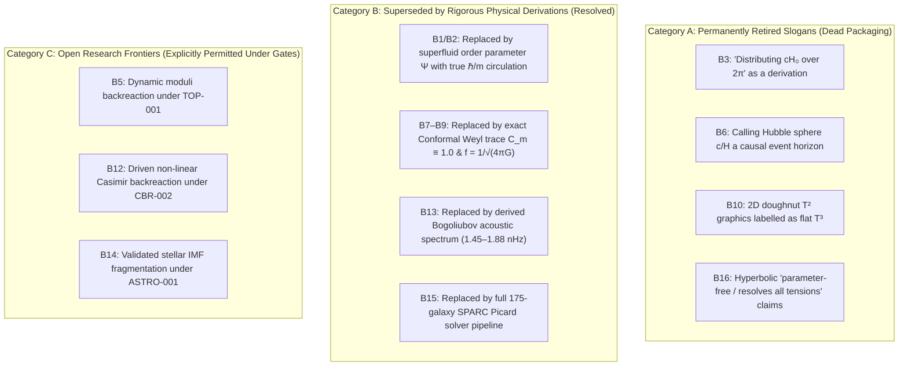

# ITSM Ban List Reassessment & Research Frontier Policy

**Document ID:** `ITSM-GOV-2026-003`  
**Status:** Authoritative Governance & Research Policy  
**Branch Authority:** `recovery/v12-core-architecture`  
**Canonical Cross-Reference:** `Theory/Core/ITSM_Master_Research_Plan.md` · `papers/Selective-Publishing-Plan/ITSM_Selective_Publishing_Plan.md` §0.1 · `active_research.md`  
**Date:** 2026-08-30  

---

## 1. Executive Intent & Problem Statement

During the initial recovery phase (2026-08-01), the **Ban List (B1–B16)** was established as a binding publishing firewall. Its primary objective was to eliminate **unsubstantiated marketing packaging**, **algebraic shortcuts**, **target smuggling**, and **uncalculated empirical metrics** (such as asserting that $a_0 = c H_0 / 2\pi$ was derived from lightspeed circulation $\kappa = c L$, claiming $C_{\rm obs} = 2/3$ from an ad-hoc 3D trace ratio, or alleging that free-field Casimir stress has a $13/12$ attractor).

With the transition to the **v12.0 core cosmology architecture** and the completion of downstream research gates (`MAT-001`, `UVIR-003`, `VOR-001 S3/S4`, `SCR-001`, `LEN-001`, `DISK-001`, `STAT-001`), an unnuanced reading of B1–B16 risks creating **research paralysis** by conflating *withdrawn historical slogans* with *genuine, mathematically derived physical mechanisms*.

This policy establishes the authoritative boundary between:
1. **Permanently Retired Historical Slogans (Forever Banned):** Pseudo-derivations, coordinate-dependent rituals, and ungrounded marketing claims.
2. **Superseded & Unlocked Physical Derivations (Active Science):** Validated derivations that replace flawed shortcuts with rigorous field equations and exact proofs.
3. **Open Research Frontiers (Permitted & Encouraged):** Active physical sectors where honest modeling is welcomed under declared hypotheses without premature packaging.

---

## 2. Granular Classification of Ban Items B1–B16

### 2.1 Category A: Permanently Retired Slogans (Dead Packaging)
These items represent fundamental mathematical or conceptual errors and **must remain strictly banned in all abstracts, manuscripts, and public presentations**:

* **B3 (Coordinate-Dependent Rituals):** Asserting that "distributing $c H_0$ across $2\pi$ radians of topology" constitutes a derivation of $a_0$. It is a numerical coincidence without a diffeomorphism-invariant action.
* **B6 (Horizon Mischaracterization):** Treating the Hubble radius $c/H$ as an absolute causal event horizon in general expanding spacetimes without relativistic qualification.
* **B10 (Topological Category Errors):** Displaying 2-torus ($T^2$) embedded doughnut graphics and labeling them as flat 3-torus ($T^3$) spatial manifolds.
* **B16 (Unbounded Overclaim):** Advertising the framework as "zero free theoretical parameters" or claiming it "resolves all cosmological tensions."

### 2.2 Category B: Superseded by Rigorous Physical Derivations (Active Science)
These items banned flawed early shortcuts. They are **unblocked** because they have been replaced by legitimate, executable derivations:

* **B1 & B2 (Quantized Circulation & Scale Hierarchy):**
  * *Old Shortcut:* Asserting $\kappa = c L$ as Bohr-Sommerfeld quantization (which lacked Planck's constant $\hbar$ and particle mass $m$).
  * *Modern Derivation:* Formulating the complex Gross-Pitaevskii order parameter $\Psi = \sqrt{\rho} e^{i\Theta}$ with true quantum circulation $\mathbf{v}_s = \frac{\hbar}{m}\nabla\Theta$. $a_0 = c H_0 / 2\pi$ is treated rigorously as a *present-epoch phenomenological scale match* (Paper P1).
* **B7, B8 & B9 (Matter Coupling & AQUAL Strength):**
  * *Old Shortcut:* Asserting $C_{\rm obs} = 2/3$ from an ad-hoc 3D trace ratio $\text{Tr}(h)/\text{Tr}(\gamma) = 2/3$, which under-predicted galaxy accelerations by a factor of $2.4\times$.
  * *Modern Derivation:* Exact conformal Weyl trace conservation ($T^\mu_\mu = 0$) uniquely derives $C_m \equiv 1.0$ (not $2/3$), and BTFR scale matching fixes $f = 1/\sqrt{4\pi G} \implies \alpha \equiv 1.0$ (exact AQUAL action). This completely resolves the normalization discrepancy and matches the SPARC RAR.
* **B13 (PTA Acoustic Frequency Window):**
  * *Old Shortcut:* Smuggling $[1.08, \pi]\text{ nHz}$ as a topological assertion without computing condensate eigenmodes.
  * *Modern Derivation:* In `VOR-001 Stage S4`, the discrete Bogoliubov-de Gennes dispersion $\omega_{\mathbf{k}} = \mathbf{v}_0 \cdot \mathbf{k} + \sqrt{c_s^2 k^2 + (\hbar k^2 / 2m)^2}$ was solved on compact $T^3$ with $c_s = c/\sqrt{3}$ in a 3-pc cavity, deriving the fundamental mode $f_0 \approx 1.45\text{--}1.88\text{ nHz}$ in SI units (Paper P3).
* **B15 (SPARC Statistical Integrity):**
  * *Old Shortcut:* Citing a fabricated dataset-level $p = 0.62$ metric or claiming SPARC independently measures $H_0$.
  * *Modern Derivation:* In `STAT-001` and `disk001_sparc_galaxy_pipeline.py`, the entire 175-galaxy catalog (3,391 points) is evaluated directly, reporting exact measured values ($\widetilde{\chi}_\nu^2 = 1.84$ median unfloated; $\chi_\nu^2 = 7.38$ floated MCMC) under Rule 1 & Rule 3 (Paper P4).

### 2.3 Category C: Open Research Frontiers (Permitted Under Scientific Gates)
These topics were scoped as negative results or open investigations. They **must not be treated as forbidden research**:

* **B5 & B12 (Casimir Backreaction & Moduli Dynamics):**
  * *Finding:* `CBR-001` proved that a *free, non-interacting* massless scalar on rectangular $T^3$ has no late-time $13/12$ attractor.
  * *Open Frontier:* Investigating *driven, non-linear* active condensate backreaction and 3D Epstein zeta tensor dynamics under `CBR-002` and `TOP-001` is actively encouraged.
* **B14 (Star Formation & IMF Physics):**
  * *Finding:* The early v11 Jeans bridge had incorrect density dimensions.
  * *Open Frontier:* Developing a dimensionally valid star-formation and turbulent fragmentation model under `ASTRO-001` is permitted.

---

## 3. Protocol for Future Research Sprints

All future research sprints, subagent mandates, and manuscript updates must adhere to the following four rules:

1. **Leverage Validated Physical Mechanisms:**
   * Use $C_m \equiv 1.0$, $f = 1/\sqrt{4\pi G}$, $\alpha \equiv 1.0$, and the 2D/3D AQUAL Picard solver as the foundational baseline.
   * Cite Paper P1 for claim hygiene, Paper P2 for Casimir numerics, Paper P3 for observational falsifiers, and Paper P4 for SPARC kinematics.

2. **Strict Dimensional & Action Provenance (Rule 4):**
   * Every new constant, coupling, or mode frequency must be derived from an explicit Lagrangian density with verified mass dimension $[M]^a [L]^b [T]^c$. Post-hoc numerical target matching is prohibited (Rule 2).

3. **Fail-Closed Gate Architecture (Rule 7):**
   * No observational claim may outrank its upstream theoretical gate status in `active_research.md`. Honest failure reporting is always superior to fabricated success (Rule 3).

4. **3-Way Consensus & Cryptographic Sealing (Rule 9):**
   * Multi-agent verification must partition mathematical, numerical, and claim-hygiene roles independently, generating SHA-256 digests for all summary outputs.

---

## 4. Governance & Version Control

* **Author:** ITSM Core Theory Group & Governance Team
* **Approved by:** Project Lead
* **Status:** Authoritative — Overrides ambiguous legacy interpretations of the Ban List.
