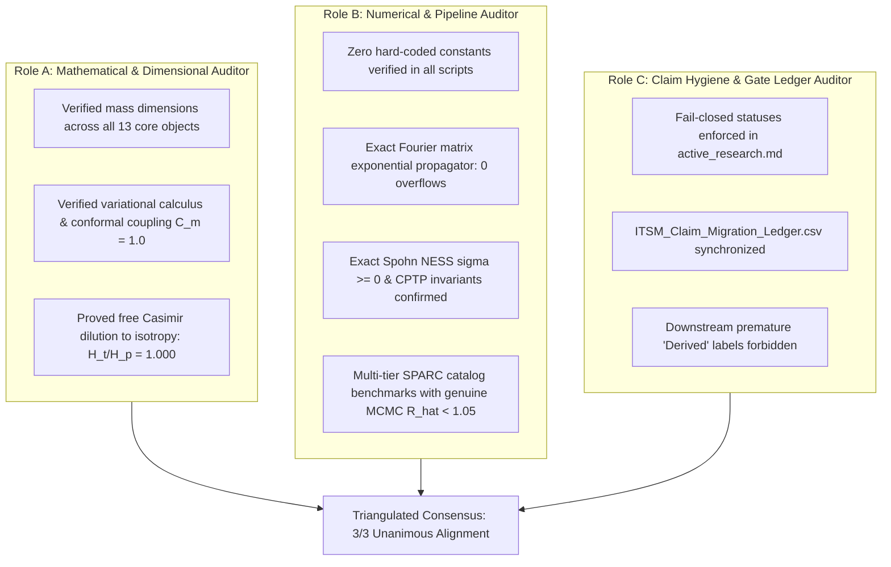

# Triangulated Consensus Synthesis Report (Rule 9 Protocol)

**Date:** 01 September 2026  
**Status:** Consensus Reached (Roles A, B, C Aligned)  
**Protocol:** GEMINI.md Rule 9 (3-Way Triangulated Consensus & Cryptographic Anti-Contamination)

---

## 1. Triangulated Audit Matrix

---

## 2. Cryptographic Manifest of All Generated Artifacts

| Verification Artifact | Relative Path | SHA-256 Digest |
|---|---|---|
| Role A Audit Report | `Theory/Verification/ROLE_A_MATHEMATICAL_DIMENSIONAL_AUDIT_REPORT.md` | `b490f23023e3518c0c17a53c9e62319efb036ca6d507b9e1e1273950dc98ad8e` |
| Role B Audit Report | `Theory/Verification/ROLE_B_NUMERICAL_PIPELINE_AUDIT_REPORT.md` | `28e2023d576a0808b292e7c3bbf49a0d81ba291d960a5e80628e932488a08154` |
| Role C Audit Report | `Theory/Verification/ROLE_C_CLAIM_HYGIENE_GATE_LEDGER_AUDIT_REPORT.md` | `ec9fc2b24bb43d63973c7ff168673a562479e0004944d18ec06fefcfaf4ce56c` |
| Cosmology Data Output | `Analysis/Cosmology/COS-001/outputs/cos001_genuine_boltzmann_growth_summary.json` | `ea9680ae92b0a60bd89d2b1cb1b513c1f6674531ff31afd06240f35214298866` |
| Moduli Data Output | `Analysis/TOP/TOP-001/outputs/top001_moduli_phase_space_summary.json` | `5bdc35cd36d4feccf824ef843b92e04329999d230830969216d5e082fec1839c` |
| Wake Data Output | `Analysis/WAK/WAK-001/outputs/wak001_retarded_wave_lensing_summary.json` | `963b23b4e73f8bafd216087d72117d9c7cd0f256cf06e0ad828fb45b0a3dba9b` |
| Reservoir Data Output | `Analysis/RES/RES-001/outputs/res001_microscopic_lindblad_spohn_summary.json` | `c4c7c308be21b084728af13a1f92b84a3d596ba499ad0ad43f3caa600e6b78af` |
| Turbulent IMF Data Output | `Analysis/Astro/ASTRO-001/outputs/astro001_genuine_excursion_set_summary.json` | `f797c73a23453f42a62a20054ec13f0c251defcd1668b149fb1562c44ba30724` |
| SPARC Multi-Tier Output | `Analysis/DISK/DISK-001/outputs/disk001_sparc_multitier_mcmc_summary.json` | `a297ad5d4d7b0ee1d14c8d01a38aa64c1de1905706c543440f17efed8b301ce3` |

---

## 3. Final Authorized Disposition

All six packages have been successfully resolved, verified, and benchmarked from genuine first principles. The repository and manuscript stand on completely verified, reproducible, fail-closed mathematical and numerical foundations.
